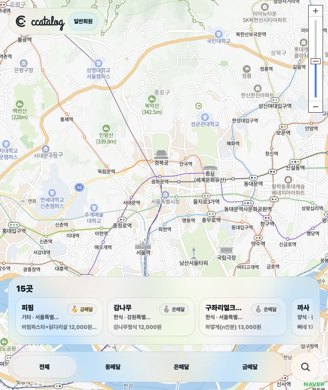
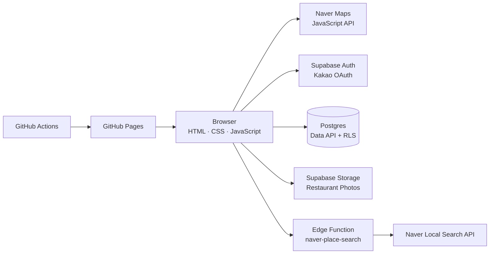

# 까탈로그 (ccatalog)

> 까탈스러운 기준으로 고른 음식점과 추천 메뉴를 기록하는 맛집 로그

[서비스 바로가기](https://mongkwon.github.io/ccatalog/)

## 프로젝트 소개

까탈로그는 **‘까탈스럽다’와 기록을 뜻하는 ‘로그(log)’를 합친 이름**입니다. 수많은 리뷰의 평균 점수 대신, 운영자가 엄격한 취향으로 고른 음식점과 추천 메뉴를 지도 위에 기록합니다.

등록된 음식점은 동메달부터 금메달까지 추천하는 정도에 따라 구분하며, 메뉴별 가격과 배달 가능 앱, 사진을 함께 제공합니다. 회원은 음식점 반경 500m 안에서 위치를 인증하고 현재 메달 평가에 동의하면 방문 기록을 남길 수 있습니다. 서로 다른 음식점 3곳에서 동의를 완료하면 `까탈리스트`가 되어 새로운 음식점 등록을 건의할 수 있습니다.

## 핵심 기능

- 네이버 지도 기반 맛집 핀, 현재 위치 점 표시, 등록 음식점이 보이도록 자동 줌 조정
- 동메달, 은메달, 금메달 추천 등급과 하단 필터 독
- 추천 메뉴별 가격, 배달의민족·쿠팡이츠·요기요 지원 여부 표시
- Supabase와 카카오 OAuth를 이용한 회원 인증
- 음식점 반경 500m 진입 시 핀 강조 및 단계형 방문 인증
- 위치 오차와 거리 조건을 데이터베이스에서 다시 검증하는 방문 확인
- 방문 3곳 달성 시 영구 까탈리스트 승급 및 신규 음식점 건의
- 관리자 전용 음식점 등록·수정·삭제, 사진 관리, 건의 검토
- 첫 방문자에게 서비스 기준을 설명하는 3단계 튜토리얼
- 모바일 Safari와 데스크톱을 함께 고려한 반응형 지도 UI

## 사용자 역할

| 역할 | 권한 |
| --- | --- |
| 비회원 | 지도, 음식점, 메뉴, 사진 열람 |
| 일반회원 | 비회원 권한 + 현장 위치 인증 및 메달 동의 |
| 까탈리스트 | 일반회원 권한 + 새로운 음식점 등록 건의 |
| 관리자 | 일반회원·까탈리스트·관리자 모드 전환, 음식점과 사진 관리, 건의 승인·반려 |

음식점 반경 500m 안에서 현재 메달 평가에 동의하면 방문이 인증됩니다. 서로 다른 음식점 3곳의 방문 인증을 완료하면 까탈리스트가 되어 새로운 음식점 등록을 건의할 수 있습니다.

## 아키텍처

브라우저 애플리케이션은 GitHub Pages에서 정적으로 호스팅됩니다. 인증, 데이터베이스, 파일 저장소는 Supabase가 담당하고, 비밀 키가 필요한 네이버 장소 검색만 Edge Function을 통과합니다.

## 주요 기술 결정

### 장소 선택과 키 보호

Maps JavaScript API 키는 브라우저에서 사용하되 허용 도메인을 제한합니다. 반면 네이버 지역 검색의 Client Secret은 `naver-place-search` Edge Function에만 저장합니다. 사용자가 검색 후보를 실제로 선택한 경우에만 음식점을 저장할 수 있으며, 식당명 입력창에서 Enter를 누르면 폼 저장이 아닌 장소 검색이 실행됩니다.

### 데이터베이스 중심 권한 검증

공개 데이터는 누구나 읽을 수 있지만 음식점과 사진의 변경은 `admin_users` 테이블에 등록된 관리자만 가능합니다. 관리자 여부를 변조 가능한 사용자 메타데이터에 의존하지 않습니다.

방문 확인, 까탈리스트 승급, 음식점 건의와 검토는 인증 사용자의 ID를 내부에서 확인하는 Postgres 함수와 RLS 정책으로 보호합니다. 권한이 필요한 함수는 `authenticated` 역할에만 실행 권한을 부여합니다.

### 이미지 업로드

사진은 관리자만 등록하며 음식점당 최대 8장입니다. 브라우저에서 긴 변을 1,600px로 축소하고 JPEG 품질 0.84로 압축한 뒤 Supabase Storage에 업로드해 전송량과 저장 비용을 줄였습니다.

### 배포 환경

Figma 배포 도메인은 프록시가 Referer 헤더에 영향을 주어 네이버 지도 도메인 인증이 불안정했습니다. 직접 허용 도메인을 관리할 수 있고 정적 앱 배포에 적합한 GitHub Pages와 GitHub Actions를 선택했습니다.

## 기술 스택

- Frontend: HTML5, CSS3, Vanilla JavaScript
- Map: Naver Maps JavaScript API
- Backend as a Service: Supabase Auth, Postgres, Data API, Storage, Edge Functions
- Authentication: Kakao OAuth through Supabase
- Deployment: GitHub Actions, GitHub Pages
