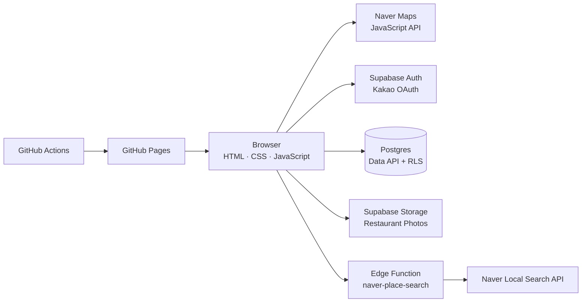

# 까탈로그 (ccatalog)

> 수많은 리뷰 점수 대신, 운영자가 직접 고른 음식점을 추천 강도와 메뉴로 기록하는 맛집 지도

[서비스 바로가기](https://mongkwon.github.io/ccatalog/)


## 프로젝트 소개

까탈로그는 음식점의 평균 점수보다 **누가 어떤 강도로 추천하는지**에 집중한 지도 서비스입니다. 운영자가 검증한 음식점을 동메달, 은메달, 금메달로 분류하고 실제 추천 메뉴와 가격, 배달 가능 앱, 사진을 함께 제공합니다.

회원은 음식점 현장에서 위치를 인증한 뒤 현재 메달에 동의해야 방문 기록을 남길 수 있습니다. 서로 다른 음식점 3곳에서 동의를 완료하면 `까탈리스트`가 되어 새로운 음식점 등록을 건의할 수 있습니다.

## 핵심 기능

- 네이버 지도 기반 맛집 핀, 현재 위치 중심 진입, 등록 음식점이 보이도록 자동 줌 조정
- 동메달, 은메달, 금메달 추천 등급과 하단 필터 독
- 추천 메뉴별 가격, 배달의민족·쿠팡이츠·요기요 지원 여부 표시
- Supabase와 카카오 OAuth를 이용한 회원 인증
- 위치 오차와 거리 조건을 검증하는 방문 확인
- 방문 3곳 달성 시 영구 까탈리스트 승급 및 신규 음식점 건의
- 관리자 전용 음식점 등록·수정·삭제, 사진 관리, 건의 검토
- 첫 방문자에게 서비스 기준을 설명하는 3단계 튜토리얼
- 모바일 Safari와 데스크톱을 함께 고려한 반응형 지도 UI

## 사용자 역할

| 역할 | 권한 |
| --- | --- |
| 비회원 | 지도, 음식점, 메뉴, 사진 열람 |
| 일반회원 | 비회원 권한 + 현장 위치 인증 및 메달 동의 |
| 까탈리스트 | 일반회원 권한 + 새로운 음식점 등록 건의 |
| 관리자 | 일반회원·까탈리스트·관리자 모드 전환, 음식점과 사진 관리, 건의 승인·반려 |

까탈리스트 승급은 클라이언트 표시가 아니라 데이터베이스 함수에서 계산합니다. 같은 음식점은 사용자당 한 번만 인정하며, 방문 기록은 **현재 위치와 음식점 간 거리 500m 이하**, **위치 정확도 200m 이하**, **현재 메달 동의** 조건을 모두 만족해야 생성됩니다.

## 아키텍처



브라우저 애플리케이션은 GitHub Pages에서 정적으로 호스팅됩니다. 인증, 데이터베이스, 파일 저장소는 Supabase가 담당하고, 비밀 키가 필요한 네이버 장소 검색만 Edge Function을 통과합니다.

## 주요 기술 결정

### 장소 선택과 키 보호

Maps JavaScript API 키는 브라우저에서 사용하되 허용 도메인을 제한합니다. 반면 네이버 지역 검색의 Client Secret은 `naver-place-search` Edge Function에만 저장합니다. 사용자가 검색 후보를 실제로 선택한 경우에만 음식점을 저장할 수 있으며, 식당명 입력창에서 Enter를 누르면 폼 저장이 아닌 장소 검색이 실행됩니다.

### 데이터베이스 중심 권한 검증

공개 데이터는 누구나 읽을 수 있지만 음식점과 사진의 변경은 `admin_users` 테이블에 등록된 관리자만 가능합니다. 관리자 여부를 변조 가능한 사용자 메타데이터에 의존하지 않습니다.

방문 확인, 까탈리스트 승급, 음식점 건의와 검토는 인증 사용자의 ID를 내부에서 확인하는 Postgres 함수와 RLS 정책으로 보호합니다. 권한이 필요한 함수는 `authenticated` 역할에만 실행 권한을 부여합니다.

### 이미지 업로드

사진은 관리자만 등록하며 음식점당 최대 8장입니다. 브라우저에서 긴 변을 1,600px로 축소하고 JPEG 품질 0.84로 압축한 뒤 Supabase Storage에 업로드해 전송량과 저장 비용을 줄였습니다.

### 배포 환경

Figma 배포 도메인은 프록시가 Referer 헤더에 영향을 주어 네이버 지도 도메인 인증이 불안정했습니다. 직접 허용 도메인을 관리할 수 있고 정적 앱 배포에 적합한 GitHub Pages와 GitHub Actions를 선택했습니다.

## 기술 스택

- Frontend: HTML5, CSS3, Vanilla JavaScript
- Map: Naver Maps JavaScript API
- Backend as a Service: Supabase Auth, Postgres, Data API, Storage, Edge Functions
- Authentication: Kakao OAuth through Supabase
- Deployment: GitHub Actions, GitHub Pages

## 프로젝트 구조

```text
.
├── outputs/ccatalog/             # 배포되는 프론트엔드
├── supabase/functions/           # 네이버 장소 검색 Edge Function
├── supabase/migrations/          # 운영 DB 변경 이력
├── supabase/schema.sql           # 초기 스키마 기준점
├── docs/images/                  # README 이미지
└── .github/workflows/deploy.yml  # GitHub Pages 배포
```

## 로컬 실행

`outputs/ccatalog/config.json`을 생성합니다. 이 파일은 Git에 포함되지 않습니다.

```json
{
  "naverMapKey": "네이버 Maps JavaScript API ncpKeyId",
  "supabaseUrl": "https://PROJECT_REF.supabase.co",
  "supabaseAnonKey": "Supabase anon public key"
}
```

정적 서버를 실행합니다.

```bash
npx serve outputs/ccatalog
```

네이버 클라우드 콘솔의 Maps 애플리케이션에는 사용하는 로컬 주소와 운영 주소를 Web 서비스 URL로 등록해야 합니다. 지도 스크립트는 현재 방식인 `ncpKeyId` 파라미터를 사용합니다.

## Supabase 구성

1. Supabase 프로젝트에서 Data API와 RLS를 활성화합니다.
2. `supabase/schema.sql`을 초기 스키마의 기준으로 사용합니다.
3. `supabase/migrations`의 변경 이력을 순서대로 반영합니다.
4. `naver-place-search`를 배포하고 `NAVER_SEARCH_CLIENT_ID`, `NAVER_SEARCH_CLIENT_SECRET`을 Edge Function secret으로 설정합니다.
5. Kakao OAuth provider와 허용 Redirect URL을 설정합니다.

브라우저에는 공개 가능한 `anon` 키만 전달합니다. RLS를 우회하는 `service_role` 또는 `sb_secret_...` 키는 프론트엔드와 GitHub Pages 설정에 넣지 않습니다.

## 배포

GitHub 저장소의 Actions secret에 아래 값을 등록합니다.

```text
NAVER_MAP_KEY
SUPABASE_URL
SUPABASE_ANON_KEY
```

`main` 브랜치에 push하면 워크플로가 배포용 `config.json`을 생성하고 `outputs/ccatalog`를 GitHub Pages에 배포합니다.

## 현재 상태

회원 인증, 방문 확인, 까탈리스트 승급, 음식점 건의, 관리자 검토, 음식점 사진 관리까지 구현되어 있습니다. 다음 개선 대상으로는 관리자 계정 관리 UI, 자동화된 회귀 테스트, 사용자 방문 이력 화면을 두고 있습니다.
